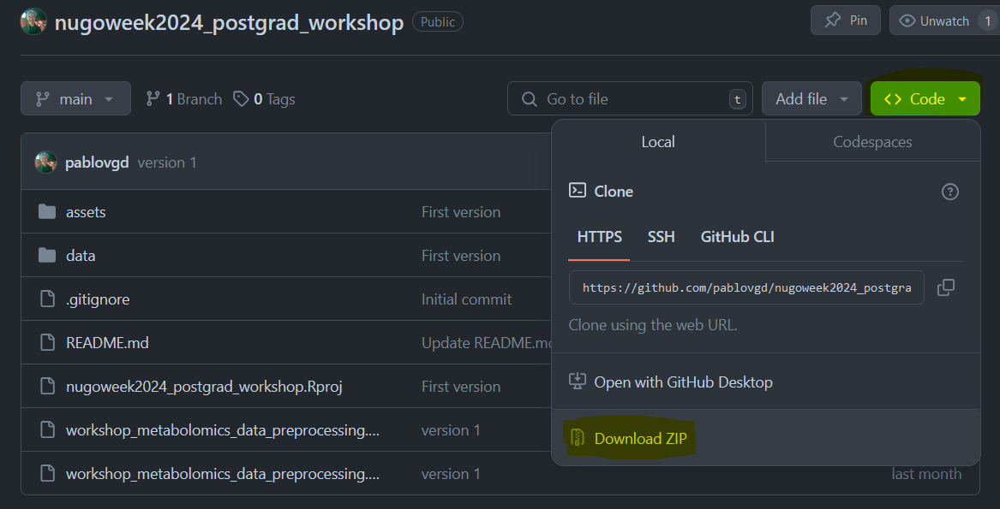

# Training in metabolomics/lipidomics data processing using R
A repository containing everything participants of the post-graduate course will need to complete the workshop concerning metabolomics data processing.

This course will give a basic introduction on (untargeted) preprocessing of liquid chromatography coupled to mass spectrometry (LC-MS) (also extendable to GC-MS or LC-MS/MS) based metabolomics.
The methods and workflow presented in this course our mainly based on the workflow presented by the [xcms package](https://bioconductor.org/packages/release/bioc/html/xcms.html) on Bioconductor.

For this course, you will need R version > 4.4.

You can download and install R [here](https://cloud.r-project.org/)

And Rstudio can be downloaded and installed from [here](https://posit.co/download/rstudio-desktop/)

The packages needed to complete the course can be installed by running the next code block:

```
if (!require("BiocManager", quietly = TRUE))
    install.packages("BiocManager")

BiocManager::install("xcms")
install.packages("remotes")
remotes::install_github("https://github.com/wkumler/squallms")
install.packages("RColorBrewer")
install.packages("RaMS")
install.packages("ggplot2")
install.packages("dplyr")

```

Download the Github repository as a .zip file and extract in a working directory to your liking. Then open the .RProj file to start the workshop.



