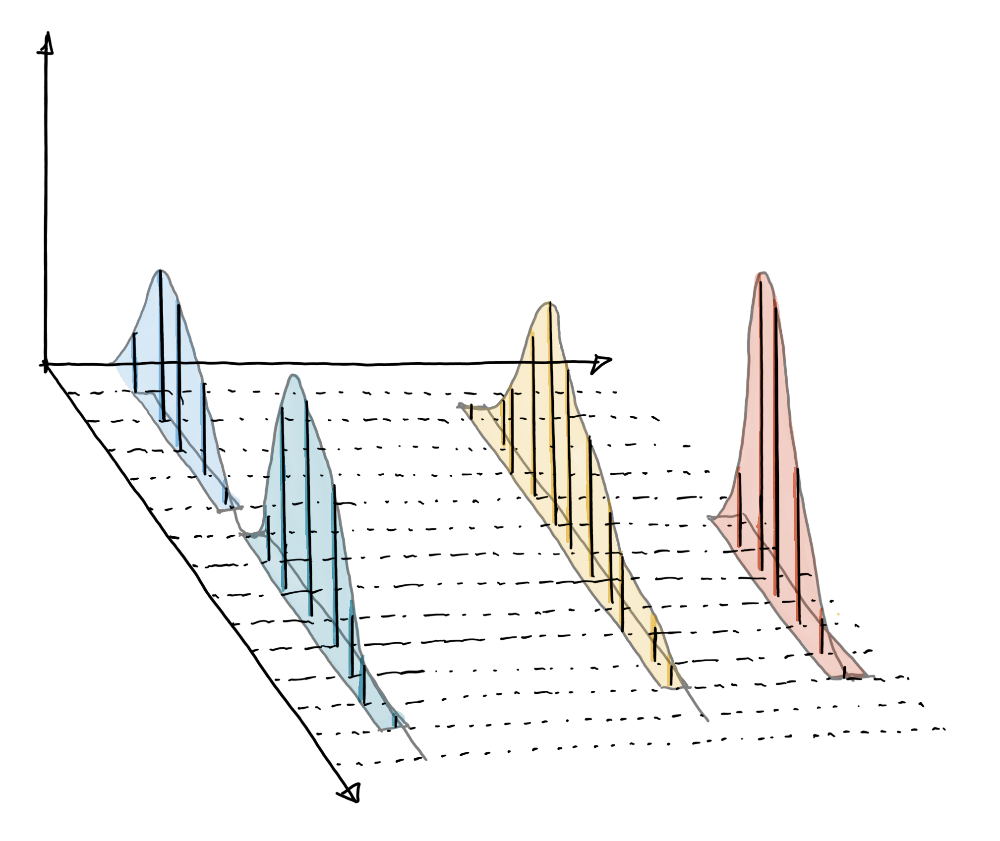

```{r setup, include=FALSE}
knitr::opts_chunk$set(echo = TRUE)
```

# Introduction

## Preliminary info

This course will give a basic introduction on (untargeted) preprocessing of liquid chromatography coupled to mass spectrometry (LC-MS) (also extendable to GC-MS or LC-MS/MS) based metabolomics. 
The methods and workflow presented in this course our mainly based on the workflow presented by the [xcms package](https://bioconductor.org/packages/release/bioc/html/xcms.html) on Bioconductor. 

For this course, you will need R version > 4.4.

If you haven't already, the packages needed to complete today's course can be installed by running the next code block:

```{r eval=FALSE, include=TRUE}
if (!require("BiocManager", quietly = TRUE))
    install.packages("BiocManager")

BiocManager::install("xcms")
install.packages("remotes") 
remotes::install_github("https://github.com/wkumler/squallms")
install.packages("RColorBrewer")
install.packages("RaMS")
install.packages("ggplot2")
install.packages("dplyr")

```

And load the required packages:

```{r message=FALSE, warning=FALSE}
library(xcms)
library(MsExperiment)
library(Spectra)
library(RColorBrewer)
library(squallms)
library(dplyr)
library(ggplot2)
library(SummarizedExperiment)
library(RaMS)
```

## Review of LC-MS data

First, let's do a quick review of what kind of data we are dealing with.
LC-MS data is generated by first separating chemical molecules using LC or GC columns based on certain properties (e.g. polarity). Afterwards the molecules are ionized, and in the MS instrument, they are separated based on their mass-to-charge ratio or *m/z* and their intensity (abundance) is measured. Thus, molecules are separated in two different dimensions, the retention time dimension (from the LC) and the mass-to-charge dimension (from the MS) making it easier to measure and identify molecules in more complex samples.


The workflow presented by `xcms` (but also applicable in for example MZmine3 and most untargeted algorithms) is:

* chromatographic peak detection: process in which chromatographic peaks are identified within a sample (file).
* alignment: process that adjusts for retention time differences (i.e. possible signal drifts from the LC) between measurements/samples.
* correspondence: grouping of chromatographic peaks (presumably from the same ion) across samples/files into LC-MS features.


## Goals of the workshop

* Learn how to preprocess LC-MS data from open-source formats (such as .mzML) in `R` using `xcms`` and other open-source packages
* Evaluate and understand the results of the pre-processing workflow
* Be able to build analysis workflows specifically tailored to your data


# Example dataset

In this course we are using a subset of the data presented in [Lloyd-Price et al. (2019)](https://www.nature.com/articles/s41586-019-1237-9). The subset was downloaded via Metaboanalyst (https://new.metaboanalyst.ca/MetaboAnalyst/upload/SpectraUpload.xhtml) and contains 10 spectra (UPLC-Q/E-ESI-, C18) organized into three groups (Healthy, Crohn's Disease and QC). The data is already available in the open-source .mzML format.

# Importing LC-MS data

First, we import our data as `MsExperiment` using the  `readMsExperiment()` function. We also add some basic metadata which contains info on the sample groups.


```{r warning=FALSE}
# Read the file names from the data folder
files <- list.files("data/",full.names = TRUE,pattern = ".mzML")

# Import the available metadata with the groups
metadata <- read.table("data/trimmed_metadata.txt",header = TRUE)
# Re-order metadata to match the files sequence
metadata <- metadata[order(metadata$Sample),]


#' Import the data of the experiment
ms_data <- readMsExperiment(files, sampleData = metadata)
```


```{r}
#Take a look at the object
ms_data
```
Our object contains 4461 MS1 spectra in 10 samples


Various functions can be used to access specific data from the object:

```{r}
#acess sample metadata
sampleData(ms_data)
```

```{r}
#access spectra data
spectra(ms_data)
```


## Centroiding data

**Attention: in order to save time, you can skip this part and read it at home later.**

MS instruments allow to export data in profile or centroid mode. Profile data contains the signal for all discrete m/z values (and retention times) for which the instrument collected data (see first figure below). MS instruments continuously sample and record signals, therefore a mass peak for a single ion in one spectrum will consist of multiple intensities at discrete m/z values. The process to reduce this distribution of signals to a single representative mass peak (the centroid, see second figure below) is called centroiding. 


In this case, we need to inspect if the data we are analyzing is profile data (and thus still needs to be centroided for use with xcms) or not. Usually, centroiding is performed when converting the data from the proprietary data format to .mzML, but it can also be performed in R (see https://jorainer.github.io/xcmsTutorials/articles/xcms-preprocessing.html#centroiding-of-profile-ms-data).


We can easily check if the data is centroided using the function `isCentroided()`. Checking in one file should be sufficient.

```{r}
isCentroided(spectra(ms_data[1]))

```


The function returns TRUE for all spectra in the sample.

Visually, we can check some of the centroided data for a known compound in the data (see suppplementary info of the Lloyd-Price paper).
In this workshop, we will be looking at:

|Method      |  mz| RT (min)| Metabolite|  
|:-----------------|----:|---:|----:|---:|
|C18n        | 538.3212|   8.66|  Met - Cholate| 


```{r}
#Here we extract the m/z and RT range for our compound in the two QC samples using filterRT & filterMzRange, afterwards we plot.
ms_data[c(9,10)] |>
    filterSpectra(filterMzRange,538.3212 + c(-0.005, 0.005)) |> # this seems to have to be exact with a particular m/z ratio
    filterSpectra(filterRt,519.6 + c(-10,10)) |> # this adjusts the x-axis, and it will not show, after/before a certain range
    plot()
```


## Basic data inspection

We can inspect the total ion chromatogram using `chromatogram()`. Setting `aggregationFun = "sum"` allows to calculate the total ion chromatogram (TIC) and `aggregationFun = "max"` the base peak chromatogram (BPC).


```{r}
#' Extract and plot a TIC
tic <- chromatogram(ms_data, aggregationFun = "sum")
plot(tic,main = "Total Ion Chromatogram")

## question: why is it this range of values? this is the time range (elusion time: the time it goes into the mass spec; this was already pre-set by the people before this session; it would usually begin from 0, or if not, it can be set in the machine to only measure the molecules that elude after a certain time limit)
```


We can also create boxplots representing the distribution of the total ion currents per data file. Such plots can be very useful to spot potentially problematic MS runs.

```{r}
## Generate a color set for the three groups
group_colors <- paste0(brewer.pal(3, "Set1")[1:3], "60")
names(group_colors) <- c("Control", "Disease","QC")

## Get the total ion current by file
tc <- spectra(ms_data) |>
    tic() |>
    split(f = fromFile(ms_data))
boxplot(tc, col = group_colors[sampleData(ms_data)$Disease],
        ylab = "intensity", main = "Total ion current")

## from asking questions, the greens are the QC; if we see much variability in the samples, we can panic, but if we see that our QC samples were consistent (which indeed it is here), then we can be fairly certain that the variability is not due to technicalities, but perhaps biological. so we move on. 
```


# Data preprocessing

In this section, we will go through the 3 main steps of LC-MS pre-processing: peak picking, alignment and correspondence (and gap filling). Remember that you should tailor the parameters and settings to your specific dataset if you are referring to this document in the future.

## Chromatographic peak detection

Chromatographic peak detection aims to identify peaks along the retention time axis that represent the signal from individual compounds’ ions. This involves identifying and quantifying such signals as shown in the sketch below.




Within `xcms`, several peak detection algorithms can be used and accessed by their respective parameter objects: `MatchedFilterParam`, `CentWaveParam` and `MassifquantParam`. However, in this workshop we will focus on the centWave algorithm (see the original publication (Tautenhahn, Böttcher, and Neumann 2008) for more details) as it is most frequently used in LC-MS metabolomics applications.

The different parameters available for the centWave algorithm can be called with `CentWaveParam()`

```{r}
CentWaveParam() # it shows the parameters, followed by the default setting which you SHOULD tweak according to your data's features
```

It is strongly discouraged to use these default parameter settings for any of your preprocessing! There are tools available that automatically configure these parameters based on your data (such as IPO and autoTuner), but generally, the best results are obtained by tuning the parameters manually to your data and ions of interest. Before running any peak detection we can first visually inspect the extracted ion chromatogram of e.g. internal standards or compounds known to be present in the samples in order to evaluate and adapt the settings of the peak detection algorithm.


Let's take another look at our known compound that we inspected earlier:

```{r warning=FALSE}
#define rt & mz ranges
rtr <- c(515, 530)
mzr <- 538.3212 + c(-0.005, 0.005)
## extract the chromatogram & add legend
chr_raw <- chromatogram(ms_data, mz = mzr, rt = rtr)
plot(chr_raw, col = group_colors[chr_raw$Disease],main = "Met - Cholate",xaxt ="n",lwd = 2) 
legend(x = 525, y = 6e5, legend = c("Control","Disease","QC"),lty = 1,col =  group_colors,cex = 1)
axis(1, at = seq(515, 530, by = 1), las=2)

```


And let's try and run centWave peak detection with the default settings in this region:

```{r warning=FALSE}
#' Get default centWave parameters
cwp <- CentWaveParam()

#' "dry-run" peak detection on the EIC.
res <- findChromPeaks(chr_raw, param = cwp)
chromPeaks(res)
```


As expected, no peaks are found by the algorithm.

From the raw chromatogram, we can see that we have a 4 chromatographic peaks present in 2 of the control samples, and in 2 of the QC samples, but the peak seems to be absent in the disease samples. 


We can see that the peak width is quite small, at its smallest it is about 5 seconds, so of course, running with a default minimum `peakwidth` of 20, yields no results.  In general, the lower and upper peak width should be set to include most of the expected chromatographic peak widths. A good rule of thumb is to set it from about half to about twice the average expected peak width. For the present data set we thus set `peakwidth = c(2, 10)`.


Let's try again:

```{r warning=FALSE}
#'  centWave parameters
cwp <- CentWaveParam(peakwidth = c(2,10))

#' Peak detection on the EIC.
res <- findChromPeaks(chr_raw, param = cwp)
chromPeaks(res)
```


We still don't detect any peaks, so let's delve a little bit deeper into the parameters and find out what we can change to improve this.
Remember that the help pages usually contain all the info you need!


```{r}
?CentWaveParam
```


On the help page, we find a detailed description of the different parameters, such as:

* `snthresh	numeric(1) defining the signal to noise ratio cutoff.`

When using centWave in extracted ion chromatograms, it often fails to  estimate the noise level correctly, so it is advised to set the snthresh parameter quite low and later use a higher value when performing peak detection in the complete data range.


Trying again:

```{r warning=FALSE}
#' centWave parameters
cwp <- CentWaveParam(peakwidth = c(2,10),snthresh = 2)

#' Peak detection on the EIC.
res <- findChromPeaks(chr_raw, param = cwp)
chromPeaks(res)
```


Now we do detect peaks in two of the samples, for each peak we get:` "rt" (retention time of the peak apex), "rtmin" (minimal retention time), "rtmax" (maximal retention time), "into" (integrated, original, intensity of the peak), "maxo" (maximum intentity of the peak).`


We can also plot the integration areas:


```{r}
plot(res,  col = group_colors[chr_raw$Disease],main = "Met - Cholate",lwd = 2)
```


This already looks promising, but a lot of the peaks we can see are still left out. Let's drop the `snthresh` parameter to 1.

```{r warning=FALSE}
#' centWave parameters
cwp <- CentWaveParam(peakwidth = c(2,10),snthresh = 1)

#' Peak detection on the EIC.
res <- findChromPeaks(chr_raw, param = cwp)
chromPeaks(res)
```

```{r}
plot(res,col = group_colors[chr_raw$Disease],main = "Met - Cholate",lwd = 2)
```


Now we already observe some strange behavior! Notice that 4/5 peaks have a `sn` > 2 in our latest results, while in the first run with `snthresh = 2`, only two peaks were integrated. Indeed, the centWave algorithm can behave quite strange, especially in small rt & *m/z* ranges, so data evaluation afterwards is important. Also, we note that the small peak that is lying in the noise level in the plot, also get's integrated. To mitigate this, we change the `noise`parameter to 80000. 

From the help page:` numeric(1) allowing to set a minimum intensity required for centroids to be considered in the first analysis step (centroids with intensity < noise are omitted from ROI detection).`


```{r warning=FALSE}
#' centWave parameters
cwp <- CentWaveParam(peakwidth = c(2,10),snthresh = 1,noise = 8e4)

#' Peak detection on the EIC.
res <- findChromPeaks(chr_raw, param = cwp)
chromPeaks(res)
```

```{r}
plot(res,col = group_colors[chr_raw$Disease],main = "Met - Cholate",lwd = 2)
```


With these settings, all the peaks in the EIC are correctly picked by the algorithm.


Another important parameter to define for your data is `ppm.` 

`numeric(1) defining the maximal tolerated m/z deviation in consecutive scans in parts per million (ppm) for the initial ROI definition.`


This is highly dependent on the instrument you are using and the precision you're expecting. In the next code block, we will check what the expected ppm deviation is for the ion.


To be a bit quicker, we will only check the QCs:

```{r}
target <- ms_data[c(9,10)] |>
    filterSpectra(filterMzRange,538.3212 + c(-0.005, 0.005)) |>
    filterSpectra(filterRt,519.6 + c(-10,10)) 
```


```{r}
plot(target)
```


We can observe some scattering of the data points around an *m/z* of 538.320 in the lower panel of the above plot. This scattering also decreases with increasing signal intensity (as for many MS instruments the precision of the signal increases with the intensity). To quantify the observed differences in m/z values for the signal of the ion we restrict the data to a  region with signal for the  ion. Below we first subset the data to the first file and then restrict the *m/z* range to values between 538.319 and 538.321

```{r}
#' Reduce the data set to signal of the ion
signal <- target[1] |>
    filterSpectra(filterMzRange,c(538.319, 538.321)) |>
    spectra()
```


We  extract the *m/z* values of the peaks from the consecutive scans and calculate the absolute difference between them.and express these differences in ppm (parts per million) of the average *m/z* of the peaks.

```{r}
#' Calculate the difference in m/z values between scans
mz_diff <- signal |>
    mz() |>
    unlist() |>
    diff() |>
    abs()

mz_diff * 1e6 / mean(unlist(mz(signal)))


```


It seems like the data is coming from a highly accurate instrument, as the ppm deviation is between 0 & 2! To accept some variance for other peaks that might me measured less accurately, we will set the ppm of centWave to 5.


It's recommended to perform the above steps on a few known compounds and/or internal standard to get a good idea of what kind of parameters you should use for our dataset. Keeping our limited time in mind, we will try and see how we fare with our newly chosen parameters (leaving `snthresh` to the default of 10, to save some time and taking into account that centWave should better estimate the noise in the whole chromatogram). Also, we set `verboseBetaColumns = TRUE`, this fairly new parameter calculates new quality metrics for all the peaks based on the work by [Kumler et al. (2023)](https://bmcbioinformatics.biomedcentral.com/articles/10.1186/s12859-023-05533-4).


```{r warning=FALSE}
#' Perform peak detection on the full data set
cwp <- CentWaveParam(peakwidth = c(2, 10), ppm = 5,noise = 8e4,verboseBetaColumns = TRUE)
mse <- findChromPeaks(ms_data, param = cwp)
```


```{r}
mse
```

We detected 9792  peaks in the dataset!

Let's double check if we managed to pick our known compound:


```{r}
chromPeaks(mse, mz = c(538.319, 538.321), rt = c(515, 535))
```

```{r}
eic <- chromatogram(mse,mz = c(538.319, 538.321), rt = c(515,530))
```

```{r}
plot(eic)
```


Note: sometimes peaks get wrongly split, for this, xcms has the function `refineChromPeaks()`, but we won't discuss this here. See the xcms documentation for more info.

## Retention time alignment

While chromatography helps to better discriminate between analytes it is also affected by variances that lead to shifts in retention times between measurement runs. Such differences can usually already be seen in a base peak chromatogram or total ion chromatogram.The alignment step aims to minimize these retention time differences between all samples within an experiment (see below for an illustration).

```{r}
plot(tic,main = "Total Ion Chromatogram")

```


There exist a lot of retention time alignment algorithms. The two main methods implemented in xcms are the *peakGroups* method (C. A. Smith et al. 2006), which aligns the samples based on so called anchor peaks: these peaks are supposed to represent signal from ions expected to be present in most of the samples of an experiment and the method aligns these samples by minimizing the between-sample retention time differences observed for these peaks. The second method is the *obiwarp* algorithm (Prince and Marcotte 2006), which uses the full *m/z* and retention time data. It's possible to perform retention time using info from all the samples, or only a subset of samples. For more information, see the xcms documentation. Here, since we have limited knowledge of the dataset or possible anchor peaks, we choose to use the *obiwarp* method. In xcms, the alignment can be performed with the `adjustRtime()` function.


One important parameter to adjust is `binSize`: , i.e. aggregating of intensity values falling within an *m/z* bin. Since we are dealing with a high res instrument, we'll set it at 0.01. 


```{r}
mse <- adjustRtime(mse, param = ObiwarpParam(binSize = 0.01))
```

We can visually evaluate the alignment by plotting the original tic and the adjusted one, as well as a plot of the differences.


```{r warning=FALSE}
tic_adj <- chromatogram(mse, aggregationFun = "sum", chromPeaks = "none")
par(mfrow = c(3, 1), mar = c(4.5, 4.2, 1, 0.5))
plot(tic)
grid()
plot(tic_adj)
grid()
## Plot also the difference of adjusted to raw retention time.
plotAdjustedRtime(mse)
grid()
```


Retention time drift certainly wasn't the worst in this dataset, but still we see some small improvement after performing the alignment step.


Evaluating the impact on our target peak:


```{r}
par(mfrow = c(2, 1))
## Plot the raw data
plot(chr_raw)
grid()
## Extract the chromatogram from the adjusted object
chr_adj <- chromatogram(mse, rt = rtr, mz = mzr)
plot(chr_adj)
grid()
```


When evaluating the RT alignment in our single peak, we have to admit that it isn't perfect, since the "biggest" peak got shifted a bit too much too the right. In our experience, getting perfect peak alignment for all peaks in a dataset is quite impossible, so one has to try different algorithms and/or subset-based alignment to find results that are sufficiently good for further analysis.

## Correspondence

The final step of the LC-MS preprocessing with xcms is the correspondence analysis, in which chromatographic peaks from the same types of ions (compounds) are grouped across samples to form the so called *LC-MS features*.


In xcms, two correspondence algorithms can be used: `NearestPeaksParam` & `PeakDensityParam`. For our example we use the peak density method. This algorithm iterates through small slices along the *m/z* dimension and, within each slice, groups chromatographic peaks with similar retention times. 


Settings for this algorithm can be best tested and optimized using the `plotChromPeakDensity()` function on extracted chromatograms. The two main parameters to tune are `bw` and `binSize`


Peaks with similar retention time will result in a higher peak density at a certain retention time and are thus grouped together. The grouping depends on the smoothness of the density curve and can be configured with parameter `bw`.


Furthermore, it makes sense to perform correspondence taking into account sample groups, as we might expect different features in case or control samples. We define our groups using the `sampleGroups`parameter.


We can illustrate this using our target peak as an example:


```{r}
#' Default parameters for peak density; bw = 30
pdp <- PeakDensityParam(sampleGroups = sampleData(mse)$Disease)

#' Test these settings on the extracted slice
plotChromPeakDensity(chr_adj, param = pdp)
```


For this particular part of the data, the default settings seem to suffice, as our 4 peaks in the 4 samples succesfully are grouped in the same feature (the grey area).It is however advisable to evaluate settings on multiple slices, ideally with signal from more than one compound being present.


Let's widen to retention time for this slice, and see what happens.


```{r}
chr_adj_wide <- chromatogram(mse, rt = rtr + c(-20,20), mz = mzr)
plotChromPeakDensity(chr_adj_wide, param = pdp)
```


This slice contains signal from several ions resulting in multiple chromatographic peaks along the retention time axis. With the default settings, in particular with `bw = 30`, all these peaks were however assigned to the same feature (indicated with the grey rectangle). Signal from different ions would thus be treated as a single entity. We repeat the analysis below with a  reduced value for parameter `bw`.


```{r}
#' Reducing the bandwidth
pdp <- PeakDensityParam(sampleGroups = sampleData(mse)$Disease, bw = 2)
plotChromPeakDensity(chr_adj_wide, param = pdp, col = group_colors[chr_adj_wide$Disease],lwd = 2)
```


Setting `bw = 2` strongly reduced the smoothness of the density curve resulting in a good seperation of the of density peaks and hence a nice grouping of (aligned) chromatographic peaks into separate features. Note that the left peak isn't grouped into a feature. This can be explained by the parameter `minFraction` (default = 0.5) which defines the proportion of samples within at least one sample group in which chromatographic peaks need to be identified in order to define a feature. As the peak is only present in 1/4 control samples, and in 1/4 disease samples, it doesn't get grouped into a feature. Adjusting to e.g. 0.2 will allow the peaks to be grouped into a feature:


```{r}
# Reducing the minFraction
pdp <- PeakDensityParam(sampleGroups = sampleData(mse)$Disease, bw = 2,minFraction = 0.2)
plotChromPeakDensity(chr_adj_wide, param = pdp, col = group_colors[chr_adj_wide$Disease],lwd = 2)
```


Finally, `binSize` defines the *m/z* widths of the slices along the m/z dimension the algorithm will iterate through. Note that by default a constant *m/z* width is used, which might however not reflect the m/z-dependent measurement error of some instruments (such as TOF instruments). To address this, the parameter ppm was recently added that allows to generate m/z-dependent bin size.


Since we seem to be dealing with a highly accurate instrument, we will allow a maximal difference of the *m/z* of chromatographic peaks of `binSize = 0.01` & 5ppm.

```{r}
# Reducing the binSize
pdp <- PeakDensityParam(sampleGroups = sampleData(mse)$Disease, bw = 2,minFraction = 0.2,binSize = 0.01,ppm = 5)
plotChromPeakDensity(chr_adj_wide, param = pdp, col = group_colors[chr_adj_wide$Disease],lwd = 2)
```


Now that we are satisfied with our settings, we can perform the correspondence on the whole dataset:


```{r}
mse <- groupChromPeaks(mse, param = pdp)
```

Inspecting the final result also shows all the steps we performed:

```{r}
mse
```


Finally, just under 3700 features are identified in this dataset.

The results from the correspondence analysis were added to the `XcmsExperiment` object. These can be extracted with the `featureDefinitions()` function, that extracts the definition of the LC-MS features and the `featureValues()` function that extracts the numerical matrix with the feature abundances (in all samples). 


```{r}
#' Definition of the features
featureDefinitions(mse) |>
    head()
```

```{r}
featureValues(mse, method = "maxint") |>
    head()
```


The feature matrix might, as can also be seen  above, contain missing values. These represent features for which no chromatographic peak was identified in one (or more) sample(s). While a number of imputation methods exist to deal with missing values, it might be more advisable to instead rescue signal. `xcms` provides such gap filling which is explained in the next section.

## Gap filling

Missing values in feature matrices from an xcms-based preprocessing represent cases in which, in a particular sample, no chromatographic peak was identified in the *m/z* - retention time region of the feature. This could either represent a truly missing value (because the ion/compound was not present in that sample) or a failure of the peak detection algorithm to identify a peak (either because the measured signal was too noisy, or too low, or a combination of both).

We'll inspect FT0001

```{r}
FT1 <- featureDefinitions(mse)[1,]
chrs <- chromatogram(mse, mz = c(FT1$mzmin,FT1$mzmax), rt = c(FT1$rtmin,FT1$rtmax) + c(-10,10))
plot(chrs, col = group_colors[chr_adj_wide$Disease], lwd = 2)
```


Looking close, the signal was likely too noisy or too sparse in some samples (i.e. to few data points to properly detect a peak). In all cases, however, signal from (presumably) the same ion was measured in the samples. Thus, reporting a missing value would not be correct for these. The aim of the gap filling is now to rescue signal for such features by integrating the intensities measured within the feature’s *m/z* - retention time area in the sample(s) in which no chromatographic peak was detected.


```{r}
mse <- fillChromPeaks(mse, param = ChromPeakAreaParam())
```


```{r}

FT1 <- featureDefinitions(mse)[1,]
chrs <- chromatogram(mse, mz = c(FT1$mzmin,FT1$mzmax), rt = c(FT1$rtmin,FT1$rtmax) + c(-10,10))
plot(chrs, col = group_colors[chr_adj_wide$Disease], lwd = 2)
```

Now all signals are correctly integrated!


## Reporting results and used parameters


`xcms` allows to easily report what steps you performed and which settings you used:

```{r}
processHistory(mse)
```

```{r}
#' Peak detection parameters
processHistory(mse)[[1]]@param
```

# Data evaluation

## Classic approaches

The `filterFeatures()` function provides a robust solution for filtering features based on  conventional quality assessment criteria. It supports multiple types of filtering, allowing users to tailor the filtering process to their specific needs, all controlled by the `filter` argument. An example for RSD (or CV) filtering is shown below.


The `RsdFilter` enable users to filter features based on their relative standard deviation (coefficient of variation) for a specified threshold. It is recommended to base the computation on quality control (QC) samples.


```{r}
# Set up parameters for RsdFilter
rsd_filter <- RsdFilter(threshold = 0.3,
                        qcIndex = sampleData(mse)$Disease == "QC")

# Apply the filter to faakho object
mse_filtered <- filterFeatures(object = mse, filter = rsd_filter)
```


## Other approaches

**Attention: in order to save time, you can skip this part and read it at home later.**


Recently, a lot of  work on peak data quality has been done by W. Kumler, so we will be using the newly implemented quality metrics in xcms and the package [squallms](https://github.com/wkumler/squallms) to evaluate the quality of the LC-MS features in our dataset. In this section we will provide a short introduction to exploring quality metrics of the features and peaks identified by `xcms.`

First, `squallms` provides a function that turns the `XcmsExperiment` object into a flat file containing the feature and peak information.

```{r}
feat_peak_info <- makeXcmsObjFlat(mse) |>
    select(feature, starts_with("mz"), starts_with("rt"), filename, filepath)

feat_peak_info |>
    head()|>
    mutate(filepath = paste0(substr(filepath, 1, 13), "~"))|>
    knitr::kable(caption = "Output from makeXcmsObjFlat.")
```

Next, we extract the most useful metrics: similarity to a bell curve (beta_corr) and the signal-to-noise ratio (SNR).


```{r}
msdata <- grabMSdata(unique(feat_peak_info$filepath), verbosity = 0)
shape_metrics <- extractChromMetrics(feat_peak_info, ms1_data = msdata$MS1)
knitr::kable(head(shape_metrics), caption = "Format of the output from extractChromMetrics")
```


We can inspect the values for these metrics for our data:

```{r}
summary(shape_metrics$med_cor)
```


```{r}
summary(shape_metrics$med_snr)
```


To get an idea of the importance and meaning of this value, we can plot a random selection of peaks that are corresponding to picked features and plot them together with their assigned metrics.

```{r}
set.seed(123)
some_random_feats <- shape_metrics |>
    slice_sample(n = 8)
some_random_feats |>
    mutate(mzmin = med_mz - med_mz * 5 / 1e6) |>
    mutate(mzmax = med_mz + med_mz * 5 / 1e6) |>
    mutate(rtmin = med_rt - 0.2) |>
    mutate(rtmax = med_rt + 0.2) |>
    left_join(msdata$MS1, join_by(
        between(y$rt, x$rtmin, x$rtmax),
        between(y$mz, x$mzmin, x$mzmax)
    )) |>
    qplotMS1data(color_col = "med_cor") +
    geom_vline(aes(xintercept = med_rt), color = "red") +
    geom_text(aes(x = Inf, y = Inf, label = paste0("SNR: ", round(med_snr))),
        data = some_random_feats, hjust = 1, vjust = 1, color = "black"
    ) +
    facet_wrap(~feature, scales = "free", nrow = 3) +
    scale_color_continuous(limits = c(0, 1), name = "Peak shape metric") +
    scale_y_continuous(expand = expansion(c(0, 0.25))) +
    theme(legend.position.inside = c(0.82, 0.12), legend.position = "inside") +
    guides(color = guide_colorbar(direction = "horizontal", title.position = "top"))
```

In the above plot we can clearly see that high quality peak data corresponds to higher scores for both SNR & the peak shape metric. However, defining strict cutoffs to filter data is hard and will require some manual inspection of more peaks. From what we see above, let's see how peaks look that have an SNR of <2 and a peak shape metric < 0.5


```{r}
set.seed(123)

bad_peaks <- subset(shape_metrics, med_cor < 0.5 & med_snr < 2) |>
    slice_sample(n = 8)

bad_peaks |>
    mutate(mzmin = med_mz - med_mz * 5 / 1e6) |>
    mutate(mzmax = med_mz + med_mz * 5 / 1e6) |>
    mutate(rtmin = med_rt - 0.2) |>
    mutate(rtmax = med_rt + 0.2) |>
    left_join(msdata$MS1, join_by(
        between(y$rt, x$rtmin, x$rtmax),
        between(y$mz, x$mzmin, x$mzmax)
    )) |>
    qplotMS1data(color_col = "med_cor") +
    geom_vline(aes(xintercept = med_rt), color = "red") +
    geom_text(aes(x = Inf, y = Inf, label = paste0("SNR: ", round(med_snr))),
        data = bad_peaks, hjust = 1, vjust = 1, color = "black"
    ) +
    facet_wrap(~feature, scales = "free", nrow = 3) +
    scale_color_continuous(limits = c(0, 1), name = "Peak shape metric") +
    scale_y_continuous(expand = expansion(c(0, 0.25))) +
    theme(legend.position.inside = c(0.82, 0.12), legend.position = "inside") +
    guides(color = guide_colorbar(direction = "horizontal", title.position = "top"))

```

We can indeed see that most of these features originate from quite bad quality peaks, although, depending on the strictness of the analyst and/or knowledge about the possible formed ion, lesser quality peak shapes might be tolerated (e.g. FT0356 & FT0760).

# Conclusion and further analysis

## Further analysis

For downstream analyses, that don’t need access to the MS data anymore, the preprocessing results could be represented equally well using a SummarizedExperiment object, which is Bioconductor’s standard container for large-scale omics data. xcms provides with the quantify() function a convenience function to extract all results from an XcmsExperiment result object and return it as a SummarizedExperiment.

```{r}
res <- quantify(mse, method = "sum")
```


After preprocessing, the data could be normalized or scaled to remove any technical variances from the data. While a simple e.g. median scaling could be done with a few lines of R code also more advanced (but not always needed) normalization algorithms are available in e.g. Bioconductor’s preprocessCore package or other packages.

Differential abundance analysis could be performed using the limma package or with any of the other packages or methods available in R.

Many chromatographic peaks (and subsequently also features) in untargeted metabolomics data sets will represent isotopes or also different ions/adducts of the same compound. The CAMERA package aimed to identify and group such features in a data set. Also, the MetaboAnnotation package provides functions to assist in the annotation of features from LC-MS as well as LC-MS/MS experiments.

For more information on general MS data analysis in R or spectra similarity calculations can be found in the [RforMassSpectrometry book](https://rformassspectrometry.github.io/book/) or in the various workshops/tutorials at [SpectraTutorials](https://jorainer.github.io/SpectraTutorials/).

## Take-home messages

This workshop provides an introduction to LC-MS metabolomics preprocessing in R using the xcms framework. It is not an exhaustive how-to and/or gold-standard for every data analysis. A lot of information and code here was derived from the documentation of xcms, which we highly recommended to check out in detail at https://bioconductor.org/packages/release/bioc/html/xcms.html and https://jorainer.github.io/xcmsTutorials/index.html. 

Some key points:

* A lot of great info is out there, we didn't (re)invent the wheel, read the docs!
* Encountering difficulties or even bugs? Don't be afraid to reach out and ask questions on e.g. github: https://github.com/sneumann/xcms/issues It's a great way to learn more and start interacting with the community.
* Don't use the default parameters without giving it some thought! 
* R/xcms isn't the only option, tools such as mzMine3 are equally good, find what floats your boat, but understand what you are doing.


